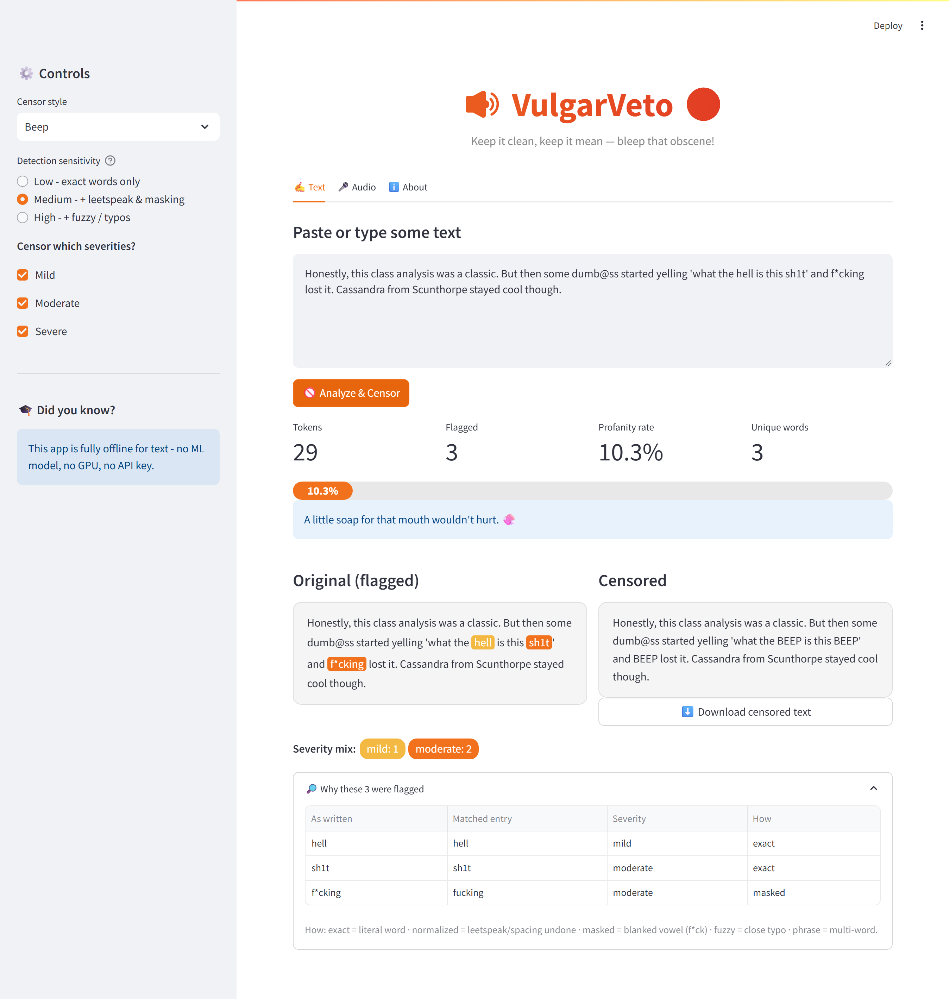
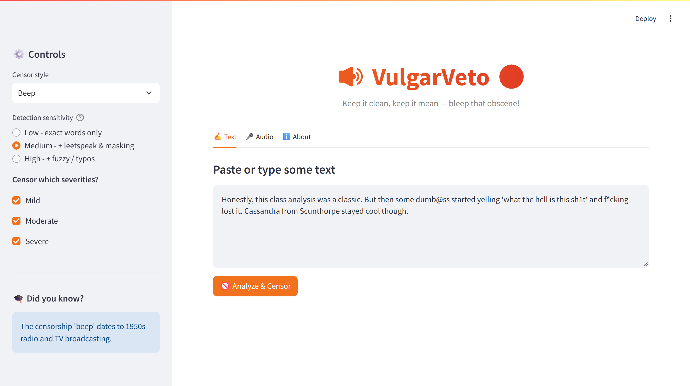
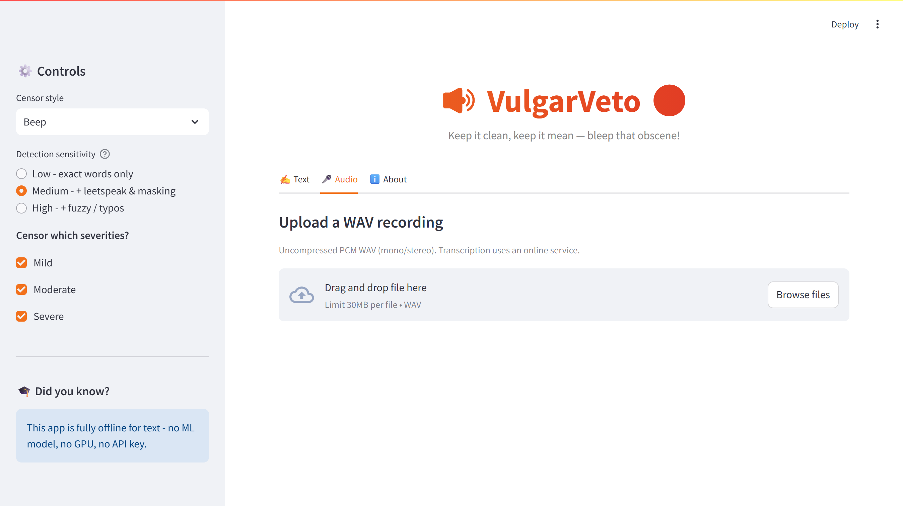
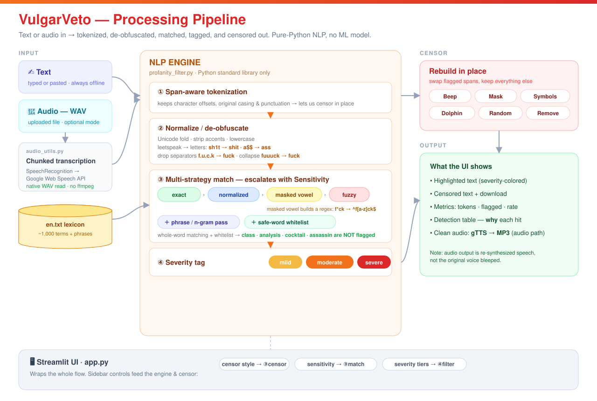

# 🔊 VulgarVeto 🚫

> Keep it clean, keep it mean — bleep that obscene!

[](https://vulgarveto-4ukrn2kibpcfsmwiysqffa.streamlit.app/)

**▶️ Live app — <https://vulgarveto-4ukrn2kibpcfsmwiysqffa.streamlit.app/>**

VulgarVeto is a compact **NLP profanity detector and censor**. Paste some text (or
upload a WAV recording) and it finds offensive language, explains *why* each word
was flagged, and rewrites it in the censor style you choose.

It runs the text pipeline **fully offline** — no ML model, no GPU, no API key —
which makes it cheap and easy to deploy on Streamlit Community Cloud.

---

## 📸 Screenshots

**Detection, censoring & explainability — all in one view**



| Landing (controls live in the sidebar) | Optional audio mode |
|:---:|:---:|
|  |  |

---

## ✨ Features

| | |
|---|---|
| **Whole-word & phrase matching** | Fixes the classic *Scunthorpe problem* — `class`, `analysis`, `cocktail`, `assassin` are **not** flagged. |
| **De-obfuscation** | Normalizes leetspeak and symbol masking before matching: `sh1t`→shit, `a$$`→ass, `f.u.c.k`→fuck, `fuuuck`→fuck, `f*ck`→fuck. |
| **Sensitivity levels** | `Low` (exact only) → `Medium` (+ leetspeak/masking) → `High` (+ fuzzy/typos). An explicit recall-vs-precision dial. |
| **Severity tiers** | Every hit is labelled *mild / moderate / severe*; choose which tiers to censor. |
| **Explainability** | A table shows the matched dictionary entry, severity, and *how* it matched. |
| **Censor styles** | Beep · Mask (`s***`) · Symbols (`@#$%`) · Dolphin (🐬) · Random · Remove. |
| **Optional audio** | Transcribe a WAV, censor the transcript, optionally re-synthesize clean speech (TTS). |

## 🧠 How the NLP works



- **Normalization** — Unicode folding, accent stripping, case folding, leetspeak
  substitution, separator removal, repeated-letter collapse.
- **Matching** — whole-word exact → normalized skeleton → masked-vowel regex
  (`f*ck` → `^f[a-z]ck$`) → conservative fuzzy (`difflib`, ratio ≥ 0.86).
- **Precision guards** — a safe-word whitelist protects common English words from
  false positives; ambiguous obfuscations resolve to the most common intended word.

All of this lives in [`profanity_filter.py`](profanity_filter.py) and is covered by
[`tests/test_profanity_filter.py`](tests/test_profanity_filter.py).

## 🚀 Run locally

```bash
pip install -r requirements.txt
streamlit run app.py
```

Then open http://localhost:8501.

## ✅ Tests

```bash
python tests/test_profanity_filter.py     # no pytest needed
# or, if you have pytest:
pytest -q
```

## ☁️ Deploy to Streamlit Community Cloud

> This repo is already deployed → **<https://vulgarveto-4ukrn2kibpcfsmwiysqffa.streamlit.app/>**

To deploy your own copy:

1. Push this folder to a **public GitHub repo**.
2. Go to [share.streamlit.io](https://share.streamlit.io) and sign in with GitHub.
3. **New app** → pick the repo/branch, set **Main file path** to `app.py`.
4. Click **Deploy**. Streamlit installs `requirements.txt` automatically.

No `packages.txt` / system packages are needed — transcription reads WAV natively,
so there is no `ffmpeg` dependency.

> **Note:** the text filter works entirely offline. The optional audio *transcription*
> and *text-to-speech* call online services, which work on Community Cloud but need
> internet access.

## 📁 Project layout

```
app.py                       Streamlit UI (text + audio tabs)
profanity_filter.py          The NLP engine (pure standard library)
audio_utils.py               Optional WAV transcription + TTS (lazy imports)
en.txt                       Profanity lexicon (~1k entries)
tests/test_profanity_filter.py   Unit tests (incl. Scunthorpe cases)
docs/pipeline.svg            Architecture / pipeline diagram
docs/screenshots/            App screenshots (used in this README)
Amplitude_Envelope.ipynb     Research notebook (spectrograms / amplitude envelopes)
Audio-Files/                 Sample recordings
requirements.txt             Lightweight deps
.streamlit/config.toml       Theme & upload limit
```

## ⚠️ Limitations

- Audio mode **re-synthesizes** the cleaned transcript with TTS — it does not bleep
  the original recording, so the speaker's voice and timing are not preserved.
- Coverage depends on `en.txt`; severity labels are heuristic and easy to tune in
  `profanity_filter.py`.
